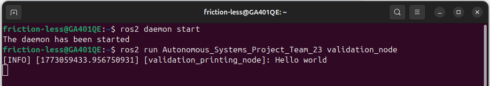

# Autonomous Ackermann Vehicle — Team 23 (ROS 2 Jazzy, GUC MCTR1002)

> Milestone 1: ROS 2 Jazzy environment validation on hardware (Raspberry Pi 4)
> and simulation (Gazebo Harmonic) platforms.

**Course**: MCTR1002 — Autonomous Systems  
**Team**: 23  
**Institution**: Mechatronics Department, German University in Cairo (GUC)

## Team

| Name | Student ID | Email |
|------|-----------|-------|
| Andrew Abdelmalak | 55-22771 | andrew.abdelmalak@student.guc.edu.eg |
| Daniel Boules | 55-5055 | daniel.boules@student.guc.edu.eg |
| David Girgis | 55-1481 | david.girgis@student.guc.edu.eg |
| Kirolous Kirolous | 55-18081 | kirolous.kirolous@student.guc.edu.eg |
| Samir Yacoub | 55-25111 | samir.yacoub@student.guc.edu.eg |
| Youssef Salama | 55-0540 | youssef.salama@student.guc.edu.eg |

---

## Project Summary

This repository contains the Milestone 1 submission for an autonomous Ackermann-steered
ground vehicle. The milestone validates that the ROS 2 Jazzy middleware is correctly
installed and operational on two target platforms:

1. **Hardware**: Raspberry Pi 4 (4 GB RAM), Ubuntu Noble 24.04 (ARM64)
2. **Simulation**: Development laptop + Gazebo Harmonic with an Ackermann SUV model

### Milestone 1 Achievements

| Deliverable | Status |
|-------------|--------|
| ROS 2 Jazzy on RPi 4 | ✓ All 5 `ros2 doctor` checks passed |
| Hardware validation node (1 Hz) | ✓ Ran for 26+ seconds |
| ROS 2 on simulation laptop | ✓ Confirmed |
| Simulation validation node | ✓ Executed |
| Ackermann vehicle in Gazebo Harmonic | ✓ Imported and running |
| Publisher/subscriber node (/cmd_vel ↔ /odom) | ✓ Implemented |

## Visual Highlights

<p align="center">
  
  &nbsp;&nbsp;
  
</p>
<p align="center"><em>Figure 1. Left: <code>ros2 doctor</code> verification on the Raspberry Pi 4 showing a valid ROS 2 Jazzy installation. Right: 1 Hz hardware validation node output on the target platform.</em></p>

<p align="center">
  
</p>
<p align="center"><em>Figure 2. Simulation-side validation node output used to confirm the ROS 2 Jazzy software stack before vehicle-level integration in Gazebo Harmonic.</em></p>

---

## Repository Structure

```
Autonomous_Systems_Project_Team_23/   ← ROS 2 package (simulation version)
  package.xml
  setup.py
  Autonomous_Systems_Project_Team_23/
    m1_validation_print_node.py        ← Prints "Hello world" once
    m1_vehicle_pub_sub_node.py         ← Pub/Sub /cmd_vel + /odom @ 1 Hz
    __init__.py
  resource/
  test/
assets/
  figures/
    m1_hardware_ros2_doctor.png              ← ros2 doctor all 5 checks passed
    m1_hardware_validation_node.png          ← Hardware 1 Hz validation node
    m1_simulation_validation_node.png        ← Simulation validation node
```

---

## Prerequisites

- **OS**: Ubuntu Noble 24.04 (tested on ARM64/RPi4 and x86-64/laptop)
- **ROS 2**: [Jazzy Jalisco](https://docs.ros.org/en/jazzy/Installation.html)
- **Simulation only**: [Gazebo Harmonic](https://gazebosim.org/docs/harmonic/install)
  with `ros-jazzy-ros-gz` bridge

---

## Build Instructions

```bash
# Clone / copy this repository into a ROS 2 workspace
mkdir -p ~/ros2_ws/src
cp -r Autonomous_Systems_Project_Team_23 ~/ros2_ws/src/

# Source ROS 2
source /opt/ros/jazzy/setup.bash

# Build
cd ~/ros2_ws
colcon build --packages-select Autonomous_Systems_Project_Team_23
source install/setup.bash
```

---

## Running the Nodes

### Hardware Validation Node (run on Raspberry Pi 4)
```bash
ros2 run Autonomous_Systems_Project_Team_23 validation_node
# Expected: "[validation_printing_node]: Hello world" (once)
```

### Simulation Validation Node
```bash
ros2 run Autonomous_Systems_Project_Team_23 validation_node
# Expected: "[validation_printing_node]: Hello world"  (once, then exits)
```

### Vehicle Publisher/Subscriber (with Gazebo running)
```bash
ros2 run Autonomous_Systems_Project_Team_23 pub_sub_node
# Publishes: Twist(linear.x=0.5, angular.z=0.2) to /cmd_vel @ 1 Hz
# Subscribes: /odom (Odometry) — logs received position
```

---

## ROS 2 Topics

| Topic | Message Type | Direction |
|-------|-------------|-----------|
| `/odom` | `nav_msgs/Odometry` | Gazebo → ROS |
| `/scan` | `sensor_msgs/LaserScan` | Gazebo → ROS |
| `/camera/image_raw` | `sensor_msgs/Image` | Gazebo → ROS |
| `/tf` | `tf2_msgs/TFMessage` | Gazebo → ROS |
| `/cmd_vel` | `geometry_msgs/Twist` | ROS → Gazebo |
| `/ackermann_cmd` | `ackermann_msgs/AckermannDriveStamped` | ROS → Gazebo |

---

## Verify Your Environment

```bash
ros2 doctor
# Expected: "All 5 checks passed"

ros2 doctor --report | grep -E 'distribution name|release|middleware name'
# Expected:
#   distribution name: jazzy
#   release: 6.8.0-xxxx
#   middleware name: rmw_fastrtps_cpp
```

---

## License

Source code: MIT (see `LICENSE` and `Autonomous_Systems_Project_Team_23/package.xml`).  
Course deliverable — copyright remains with the authors and GUC.

---

## Future Milestones

- **Milestone 2**: Sensor integration (LiDAR `/scan`, camera `/camera/image_raw`)
- **Milestone 3**: Localization (EKF via `robot_localization`, Ackermann kinematics)
- **Milestone 4**: Navigation (Frenet-frame planning, MPC local planner)
- **Milestone 5**: Full autonomous driving demonstration
