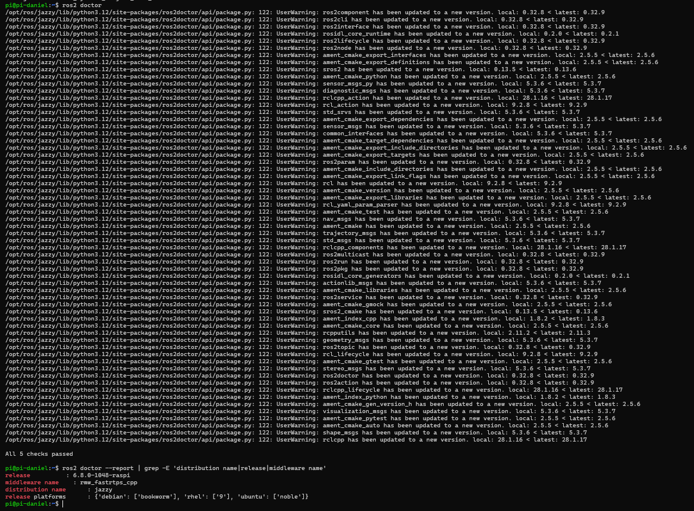
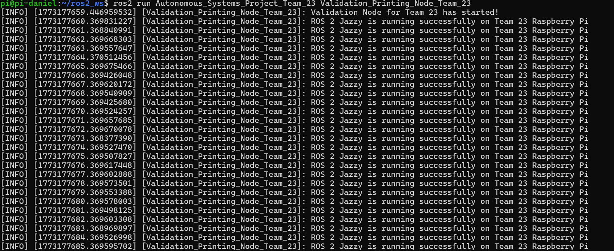
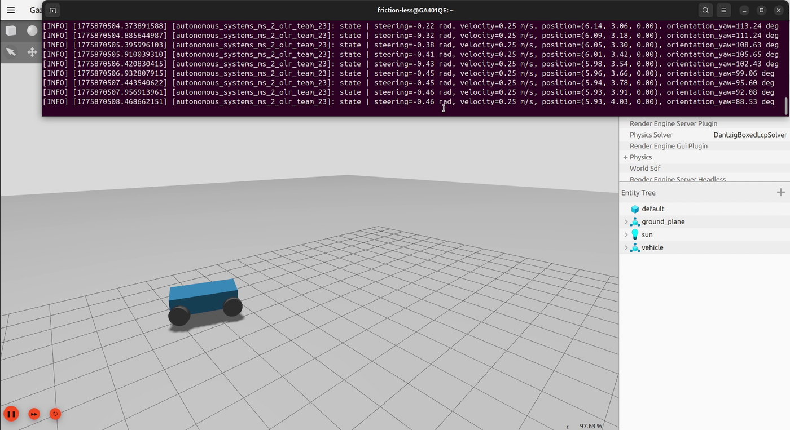
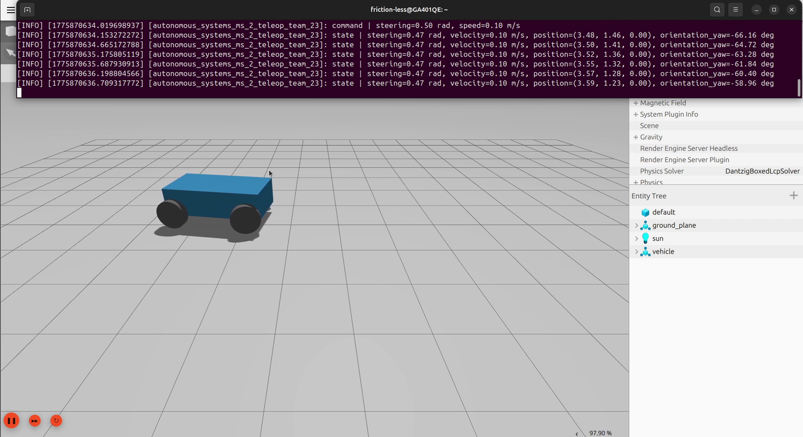
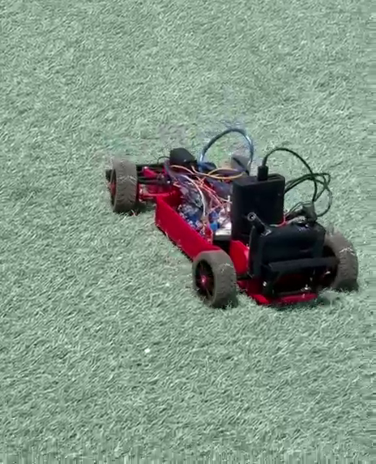

# Autonomous Ackermann Vehicle - Team 23

ROS 2 Jazzy and Gazebo Harmonic deliverables for the GUC MCTR1002 Autonomous
Systems project. The repository now documents the cumulative project state
through Milestone 2:

- Milestone 1: ROS 2 Jazzy validation on Raspberry Pi 4 hardware and Gazebo
  simulation platforms.
- Milestone 2: Gazebo empty-world Ackermann driving, open-loop response (OLR),
  keyboard teleoperation, and Arduino actuator testing.

- **Course**: MCTR1002 - Autonomous Systems
- **Team**: 23
- **Institution**: Mechatronics Department, German University in Cairo (GUC)

## Team

| Name | Student ID | Email |
|------|------------|-------|
| Andrew Abdelmalak | 55-22771 | andrew.abdelmalak@student.guc.edu.eg |
| Daniel Boules | 55-5055 | daniel.boules@student.guc.edu.eg |
| David Girgis | 55-1481 | david.girgis@student.guc.edu.eg |
| Kirolous Kirolous | 55-18081 | kirolous.kirolous@student.guc.edu.eg |
| Samir Yacoub | 55-25111 | samir.yacoub@student.guc.edu.eg |
| Youssef Salama | 55-0540 | youssef.salama@student.guc.edu.eg |

## Current Status

| Area | Deliverable | Status |
|------|-------------|--------|
| Milestone 1 hardware | ROS 2 Jazzy on Raspberry Pi 4, `ros2 doctor` all checks passed | Done |
| Milestone 1 hardware | 1 Hz validation node on Raspberry Pi | Done |
| Milestone 1 simulation | ROS 2 Jazzy and Gazebo Harmonic validation | Done |
| Milestone 1 simulation | Initial publisher/subscriber node foundation | Done |
| Milestone 2 simulation | Empty Gazebo world with `prius_team23` Ackermann model | Done |
| Milestone 2 simulation | ROS-Gazebo bridge for command, odometry, joint states, and clock | Done |
| Milestone 2 simulation | OLR driving node with parameterized speed and steering | Done |
| Milestone 2 simulation | Keyboard teleoperation node with state logging | Done |
| Milestone 2 hardware | Arduino motor/servo actuator controller with encoder feedback and PID speed loop | Done |

## Visual Evidence

<p align="center">
  
  &nbsp;&nbsp;
  
</p>
<p align="center"><em>Milestone 1: ROS 2 Jazzy validation on the Raspberry Pi hardware target.</em></p>

<p align="center">
  
</p>
<p align="center"><em>Milestone 2: OLR node publishing a constant command and logging vehicle state feedback.</em></p>

<p align="center">
  
</p>
<p align="center"><em>Milestone 2: keyboard teleoperation driving the simulated Ackermann vehicle.</em></p>

<p align="center">
  
</p>
<p align="center"><em>Milestone 2: assembled physical vehicle during actuator testing.</em></p>

## Repository Structure

```text
Autonomous_Systems_Project_Team_23/
  package.xml
  setup.py
  launch/
    Autonomous_Systems_MS_2_Team_23.launch.py
  models/
    prius_team23/
      model.config
      model.sdf
      meshes/
      materials/
  Autonomous_Systems_Project_Team_23/
    Validation_Printing_Node_Team_23.py
    Vehicle_Pub_Sub_Node_Team_23.py
    Autonomous_Systems_MS_2_OLR_Team_23.py
    Autonomous_Systems_MS_2_Teleop_Team_23.py
hardware/
  Autonomous_Systems_Project_Hardware_OLR_Actuators_Team_23/
    Autonomous_Systems_Project_Hardware_OLR_Actuators_Team_23.ino
assets/
  figures/
```

## Prerequisites

- Ubuntu Noble 24.04
- ROS 2 Jazzy Jalisco
- Gazebo Harmonic
- `ros-jazzy-ros-gz`, `ros-jazzy-ros-gz-sim`, and `ros-jazzy-ros-gz-bridge`
- `rqt_graph` for optional graph visualization
- Arduino IDE for the hardware actuator sketch
- Optional for hardware serial forwarding: `pyserial`

## Build

Clone this repository into a ROS 2 workspace and build the package:

```bash
mkdir -p ~/ros2_ws/src
cd ~/ros2_ws/src
git clone https://github.com/andrew-abdelmalak/autonomous-ackermann-vehicle.git

source /opt/ros/jazzy/setup.bash
cd ~/ros2_ws
colcon build --packages-select Autonomous_Systems_Project_Team_23
source install/setup.bash
```

## Milestone 1 Nodes

Run the validation node:

```bash
ros2 run Autonomous_Systems_Project_Team_23 validation_node
```

Run the basic publisher/subscriber node:

```bash
ros2 run Autonomous_Systems_Project_Team_23 pub_sub_node
```

## Milestone 2 Simulation

The launch file starts Gazebo Harmonic, spawns the `prius_team23` vehicle in an
empty world, starts the ROS-Gazebo bridge, and launches either OLR or teleop
mode.

### Open-Loop Response Mode

```bash
ros2 launch Autonomous_Systems_Project_Team_23 Autonomous_Systems_MS_2_Team_23.launch.py \
  control_mode:=olr \
  desired_speed:=0.25 \
  desired_steering:=0.30 \
  lane:=0.0 \
  use_rqt_graph:=true
```

The OLR node publishes a constant `geometry_msgs/msg/Twist` command to
`/model/vehicle/cmd_vel` and logs odometry plus steering feedback from
`/model/vehicle/odometry` and `joint_states`.

### Keyboard Teleoperation Mode

```bash
ros2 launch Autonomous_Systems_Project_Team_23 Autonomous_Systems_MS_2_Team_23.launch.py \
  control_mode:=teleop \
  initial_speed:=0.0 \
  desired_speed:=0.25 \
  lane:=0.0 \
  desired_lane:=0.0 \
  teleop_terminal_prefix:="gnome-terminal --" \
  use_rqt_graph:=true
```

Controls:

| Key | Action |
|-----|--------|
| Up arrow | Increase speed |
| Down arrow | Decrease speed |
| Left arrow | Increase left steering command |
| Right arrow | Increase right steering command |
| Space | Stop |
| `Q` | Stop and quit |

## Launch Arguments

| Argument | Default | Purpose |
|----------|---------|---------|
| `control_mode` | `teleop` | Select `teleop` or `olr` |
| `initial_speed` | `0.0` | Initial teleop speed in m/s |
| `lane` | `0.0` | Vehicle spawn Y offset |
| `desired_speed` | `0.25` | OLR target speed and documented teleop target |
| `desired_lane` | `0.0` | Desired lane parameter for teleop logging |
| `desired_steering` | `0.0` | OLR steering angle command in rad |
| `use_rqt_graph` | `true` | Start `rqt_graph` |
| `serial_forwarding_enabled` | `false` | Forward teleop speed/steering commands to Arduino |
| `serial_port` | `/dev/ttyACM0` | Arduino serial port |
| `serial_baudrate` | `115200` | Arduino serial baud rate |
| `teleop_terminal_prefix` | `gnome-terminal --` | Terminal wrapper for keyboard input |

## ROS 2 Interfaces

| Topic | Message Type | Direction |
|-------|--------------|-----------|
| `/clock` | `rosgraph_msgs/msg/Clock` | Gazebo to ROS |
| `/model/vehicle/cmd_vel` | `geometry_msgs/msg/Twist` | ROS to Gazebo |
| `/model/vehicle/odometry` | `nav_msgs/msg/Odometry` | Gazebo to ROS |
| `joint_states` | `sensor_msgs/msg/JointState` | Gazebo to ROS |

## Hardware Actuator Sketch

The Arduino sketch is stored under `hardware/`. It implements the submitted
Milestone 2 actuator controller:

- Parses serial commands in the format `SPD:<speed>,STR:<steering>`.
- Applies a 500 ms command timeout that stops the drive motor.
- Drives the DC motor through PWM and direction pins.
- Reads encoder ticks on interrupt pins for speed estimation.
- Runs a PID speed loop at 20 Hz.
- Maps steering commands to a servo angle around the center position.

Expected serial command example:

```text
SPD:0.250,STR:0.100
```

The teleop node can forward the same command format to an Arduino when launched
with `serial_forwarding_enabled:=true` and a valid serial port configured.

## Notes

- The Milestone 2 simulation model uses primitive geometry in `model.sdf`, while
  the package also keeps the provided model asset folders for continuity.
- The videos submitted for Milestone 2 are not committed here because they are
  large binary evidence files. Representative frames are included under
  `assets/figures/`.
- The root repository keeps the original MIT license file. The ROS 2 package
  files imported from the Milestone 2 submission include Apache-2.0 headers and
  package metadata. Course deliverables remain credited to Team 23 and GUC.
