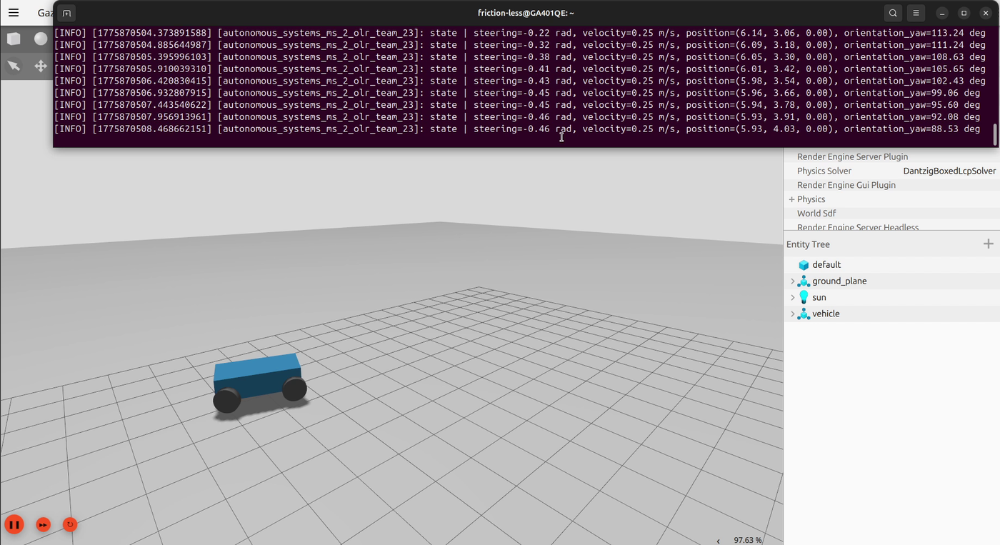

# ROS 2 Autonomous Ackermann Vehicle


**MCTR 1002 — Autonomous System · German University in Cairo · Spring 2026**

**Team 23** | Andrew Abdelmalak · Daniel Boules · David Girsis · Kirolous Kirolous · Samir Yacoub · Youssef Salama

> **Paper:** [`paper/main.tex`](paper/main.tex) — IEEE conference paper documenting the five-milestone development of a ROS 2 Ackermann vehicle from hardware validation through Kalman-filtered autonomous navigation.

---

<p align="center">
  
</p>
<p align="center"><em>Milestone 2 simulation: open-loop ramp response showing the Ackermann vehicle's actuator dynamics in Gazebo Harmonic.</em></p>

---

## Table of Contents

[Overview](#overview) · [Architecture](#architecture) · [Milestones](#milestones) · [Key Results](#key-results) · [Components](#components) · [Gains](#gains) · [Kalman Filter](#kalman-filter) · [Repository Structure](#repository-structure) · [Usage](#usage) · [Equations](#key-equations) · [Authors](#authors) · [License](#license)

---

## Overview

This repository implements a five-milestone progression for an autonomous Ackermann-steered scaled vehicle as part of the MCTR 1002 Autonomous Systems course at GUC. The project spans middleware validation (ROS 2 Jazzy on Raspberry Pi 4), simulation and teleoperation (Gazebo Harmonic), closed-loop control (PID speed + Stanley lateral), path planning across three track types, and Kalman-filtered sensor fusion for headless autonomous navigation.

The vehicle uses a Raspberry Pi 4 as the main computer running ROS 2 nodes for planning, control, and state estimation. A Raspberry Pi Pico RP2040 handles low-level actuation (L298N motor driver, MG995 steering servo) and sensor acquisition (quadrature encoder, MPU-6050 IMU) on a 50 Hz dual-core control loop. Commands are sent over USB serial at 115200 baud in the format `SPD:<speed>,STR:<steering>`.

The architecture is designed so that planning and control algorithms can be developed and tuned in Gazebo simulation, then deployed to hardware with only the serial bridge layer changing. This separation between high-level ROS 2 nodes and low-level firmware accelerated development and debugging across all five milestones.

---

## Architecture

The system processing cascade spans five milestones, each adding a layer of capability:

```
Platform:      ROS 2 Jazzy / Pi 4  ──→  Gazebo Harmonic
                                         │
Control:                        Speed PID ──→ Stanley Lateral
                                         │
Planning:                               Path Planning (3 tracks)
                                         │
Fusion:                              Kalman Filter (encoder + IMU)
                                         │
Actuation:                             Pico RP2040
                                         │
                                   L298N + MG995 Servo
```

**Simulation path:** ROS 2 nodes → `ros_gz_bridge` → Gazebo Harmonic → simulated sensor feedback.

**Hardware path:** ROS 2 nodes → serial bridge (115200 baud) → Pico RP2040 → L298N + MG995 → physical vehicle → encoder + IMU → Pico → serial → Kalman filter on Pi 4 → corrected state to planner.

---

## Milestones

| Milestone | Deliverable | Status |
|-----------|-------------|--------|
| M1 | ROS 2 Jazzy validation (Pi 4 + desktop), `ros2 doctor` diagnostics | ✓ |
| M2 | Gazebo vehicle model, OLR, keyboard teleop, hardware actuator test | ✓ |
| M3 | Closed-loop PID speed + Stanley lateral control, tuned gains | ✓ |
| M4 | 3 track environments, path planning, dead-reckoning odometry | ✓ |
| M5 | Kalman filter fusion, headless autonomous navigation | ✓ |

---

## Demo

"A scaled Ackermann vehicle navigates 3 track configurations — 10 m straight, 2-lane racing track with obstacles, and city circuit with 90° corners. ROS 2 Jazzy on Pi 4 runs PID speed + Stanley lateral controllers, plans paths from Gazebo world files, fuses encoder + IMU via Kalman filter. Commands go to Pico → L298N → TT motor + MG995 servo."

---

## Key Results (Interpreted)

**Controller gains retuned from MS3 to MS5** because the scaled model's 0.255 m wheelbase produces approximately 4× faster yaw dynamics than the 1.0 m simulation model. The yaw rate scales as $\dot{\psi} = v \tan\delta / L$, so a 0.255 m wheelbase yields roughly 4× the yaw rate for the same steering input. The initial gains ($K_p=1.2$, $K_i=0.35$) caused sustained oscillation on hardware; reducing $K_p$ to 0.85 and $K_i$ to 0.10 eliminates oscillation while maintaining steady-state accuracy.

**Stanley controller chosen over Pure Pursuit** for direct heading-error feedback on straight segments, where Pure Pursuit provides no correction when the lookahead point lies directly ahead. Stanley's $\delta = \theta_e + \arctan(k \cdot e_{\mathrm{ct}} / v)$ combines heading error with speed-adaptive cross-track correction, stabilizing both straight and curved navigation.

**Kalman filter reduces heading drift** by optimally fusing encoder distance measurements (accurate long-term) with IMU yaw rate (accurate short-term). Encoder-only odometry accumulates heading error from gyroscope bias drift (~0.04 rad/s std), while IMU-only integration drives unbounded position drift. The Kalman filter's corrected estimate outperforms either sensor alone.

---

## Components

| Component | Specification | Role |
|-----------|---------------|------|
| Raspberry Pi 4 | 4 GB RAM, Cortex-A72 | Main computer, ROS 2 nodes |
| Raspberry Pi Pico | RP2040 dual-core | Low-level actuation + sensing |
| L298N | Dual H-bridge | DC motor driver |
| TT DC gear motor | 48:1 gear ratio | Drive motor |
| MG995 servo | 50 Hz PWM, 0°–180° | Steering actuation |
| MPU-6050 | 6-DOF IMU (accel + gyro) | Heading estimation |
| Quadrature encoder | 20 PPR, 48:1 gear | Wheel speed sensing |
| Wheelbase | 0.255 m | Vehicle geometry |
| Max speed | 1.0 m/s (hardware), 0.4 m/s (sim) | Operating envelope |

---

## Controller Gains

| Parameter | Symbol | MS3 Sim ($L=1.0$ m) | MS5 Sim | MS5 HW ($L=0.255$ m) |
|-----------|--------|---------------------|---------|----------------------|
| Speed P | $K_p$ | 1.2 | 1.5 | 0.85 |
| Speed I | $K_i$ | 0.35 | 0.3 | 0.10 |
| Speed D | $K_d$ | 0.1 | 0.1 | 0.1 |
| Stanley gain | $k$ | 0.5 | 0.5 | 0.8 |
| Control rate | — | 10 Hz | 10 Hz | 50 Hz |

---

## Kalman Filter

| Matrix | Element | Value |
|--------|---------|-------|
| $\mathbf{Q}$ | $\sigma_x^2, \sigma_y^2$ | 0.01 |
| $\mathbf{Q}$ | $\sigma_\theta^2$ | 0.005 |
| $\mathbf{Q}$ | $\sigma_v^2$ | 0.001 |
| $\mathbf{R}$ | $\sigma_{zx}^2, \sigma_{zy}^2$ | 0.05 |

State vector: $\mathbf{x} = [x, y, \theta, v]^\top$

---

## Repository Structure

```text
.
├── src/
│   └── Autonomous_Systems_Project_Team_23/   # ROS 2 ament_python package
│       ├── package.xml
│       ├── setup.py
│       ├── setup.cfg
│       ├── resource/
│       ├── launch/                            # MS2 & MS3 launch files
│       ├── models/prius_team23/               # Gazebo SDF model + meshes
│       ├── test/                              # Lint + copyright tests
│       └── Autonomous_Systems_Project_Team_23/  # Python nodes
│           ├── Validation_Printing_Node_Team_23.py
│           ├── Vehicle_Pub_Sub_Node_Team_23.py
│           ├── Autonomous_Systems_MS_2_OLR_Team_23.py
│           ├── Autonomous_Systems_MS_2_Teleop_Team_23.py
│           ├── Autonomous_Systems_MS_3_CLR_Alg_1_Speed_Team_23.py
│           ├── Autonomous_Systems_MS_3_CLR_Alg_2_Lateral_Team_23.py
│           └── Autonomous_Systems_MS_3_Joy_Teleop_Team_23.py
├── arduino/
│   └── vehicle_controller.ino                # Pico firmware (50 Hz PID)
├── paper/
│   ├── main.tex                               # IEEE conference paper
│   ├── references.bib
│   ├── IEEEtran.cls
│   └── figures/                               # Paper figures
├── results/                                   # Milestone screenshots
├── docs/                                      # MS1 + MS5 reports
├── README.md
├── LICENSE                                    # MIT
├── .gitignore
├── requirements.txt
├── CONTRIBUTING.md
└── CHANGELOG.md
```

---

## Usage

### Prerequisites

- Ubuntu Noble 24.04
- ROS 2 Jazzy Jalisco
- Gazebo Harmonic
- `ros-jazzy-ros-gz`, `ros-jazzy-ros-gz-sim`, `ros-jazzy-ros-gz-bridge`
- Raspberry Pi Pico (hardware deployment)
- Arduino IDE or PlatformIO (for Pico firmware)

### ROS 2 Build

```bash
mkdir -p ~/ros2_ws/src
cd ~/ros2_ws/src
# Clone the package or copy src/Autonomous_Systems_Project_Team_23 here
source /opt/ros/jazzy/setup.bash
cd ~/ros2_ws
colcon build --packages-select Autonomous_Systems_Project_Team_23
source install/setup.bash
```

### Milestone 1 — Validation

```bash
ros2 run Autonomous_Systems_Project_Team_23 validation_node
ros2 run Autonomous_Systems_Project_Team_23 pub_sub_node
```

### Milestone 2 — OLR & Teleop

```bash
# Open-loop response
ros2 launch Autonomous_Systems_Project_Team_23 \
  Autonomous_Systems_MS_2_Team_23.launch.py \
  control_mode:=olr desired_speed:=0.25 desired_steering:=0.30 lane:=0.0

# Keyboard teleop
ros2 launch Autonomous_Systems_Project_Team_23 \
  Autonomous_Systems_MS_2_Team_23.launch.py \
  control_mode:=teleop
```

| Key | Action |
|-----|--------|
| ↑ | Increase speed |
| ↓ | Decrease speed |
| ← | Steer left |
| → | Steer right |
| Space | Stop |
| Q | Quit |

### Milestone 3 — Closed-Loop Control

```bash
ros2 launch Autonomous_Systems_Project_Team_23 \
  Autonomous_Systems_MS_3_Team_23.launch.py \
  desired_speed:=0.5 desired_lane:=0.0 desired_heading:=0.0
```

### Pico Firmware

Upload `arduino/vehicle_controller.ino` to the Raspberry Pi Pico (RP2040). The firmware parses serial commands (`SPD:<speed>,STR:<steering>`), runs a 50 Hz PID speed loop with encoder feedback, reads the MPU-6050 IMU over I2C, and transmits odometry back at 50 Hz.

### Overleaf / LaTeX

The paper is in `paper/main.tex`. Compile with:

```bash
cd paper
pdflatex main.tex
bibtex main
pdflatex main.tex
pdflatex main.tex
```

---

## Key Equations

### Ackermann Condition

$$
\cot\delta_o - \cot\delta_i = \frac{T}{L}
$$

### Yaw Rate (Kinematic Bicycle Model)

$$
\dot{\psi} = \frac{v \tan\delta}{L}
$$

### PID Speed Controller

$$
u(t) = K_p e(t) + K_i \int_{0}^{t} e(\tau)\,d\tau + K_d \frac{de(t)}{dt}
$$

### Stanley Lateral Controller

$$
\delta(t) = \theta_e(t) + \arctan\!\left(\frac{k \cdot e_{\mathrm{ct}}(t)}{v(t)}\right)
$$

### Dead-Reckoning Odometry

$$
\begin{aligned}
x_{k+1} &= x_k + v\cos\theta\,\Delta t \\
y_{k+1} &= y_k + v\sin\theta\,\Delta t \\
\theta_{k+1} &= \theta_k + \dot{\psi}\,\Delta t
\end{aligned}
$$

### Kalman Filter

**Prediction:**
$$
\begin{aligned}
\hat{\mathbf{x}}_{k|k-1} &= \mathbf{F}_k \hat{\mathbf{x}}_{k-1|k-1} + \mathbf{B}_k \mathbf{u}_k \\
\mathbf{P}_{k|k-1} &= \mathbf{F}_k \mathbf{P}_{k-1|k-1} \mathbf{F}_k^\top + \mathbf{Q}_k
\end{aligned}
$$

**Kalman gain:**
$$
\mathbf{K}_k = \mathbf{P}_{k|k-1} \mathbf{H}_k^\top (\mathbf{H}_k \mathbf{P}_{k|k-1} \mathbf{H}_k^\top + \mathbf{R}_k)^{-1}
$$

**Update:**
$$
\begin{aligned}
\hat{\mathbf{x}}_{k|k} &= \hat{\mathbf{x}}_{k|k-1} + \mathbf{K}_k (\mathbf{z}_k - \mathbf{H}_k \hat{\mathbf{x}}_{k|k-1}) \\
\mathbf{P}_{k|k} &= (\mathbf{I} - \mathbf{K}_k \mathbf{H}_k) \mathbf{P}_{k|k-1}
\end{aligned}
$$

---

## Authors

| Name | Student ID | GitHub |
|------|------------|--------|
| Andrew Abdelmalak | 55-22771 | [@andrew-abdelmalak](https://github.com/andrew-abdelmalak) |
| Daniel Boules | 55-5055 | — |
| David Girgis | 55-1481 | — |
| Kirolous Kirolous | 55-18081 | — |
| Samir Yacoub | 55-25111 | — |
| Youssef Salama | 55-0540 | — |

**Supervised by:** Dr. Omar M. Shehata · Eng. Dalia M. Mahfouz

---

## License

MIT — see [LICENSE](LICENSE). Copyright (c) 2026 Team 23, German University in Cairo.
