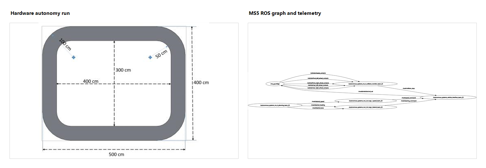
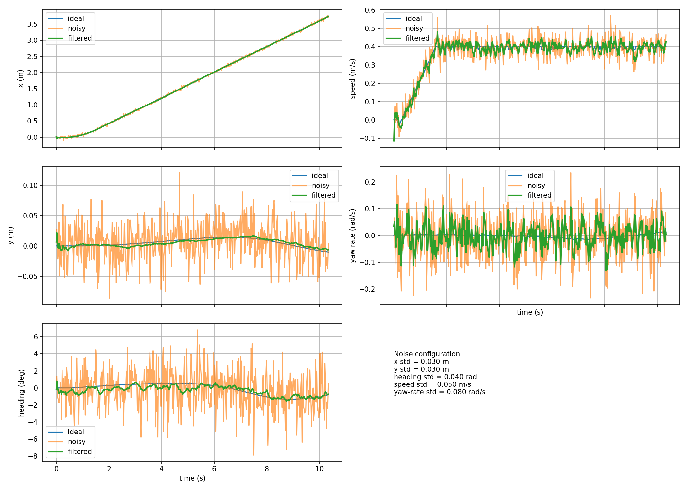
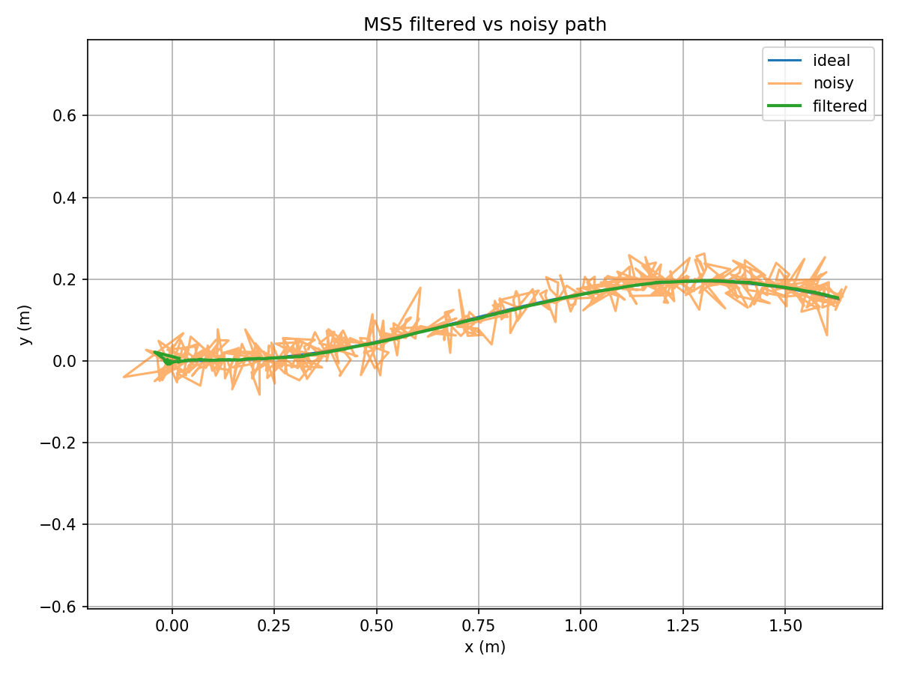

# Autonomous Ackermann Vehicle


**MCTR 1002 Autonomous System · German University in Cairo · Spring 2026**

**Team 23** | Andrew Abdelmalak · Daniel Boules · David Girgis · Kirolous Kirolous · Samir Yacoub · Youssef Salama

**Paper PDF:** [`docs/autonomous_ackermann_vehicle_paper.pdf`](docs/autonomous_ackermann_vehicle_paper.pdf)

**Paper Source:** [`paper/main.tex`](paper/main.tex)

This repository contains the final integrated ROS 2 Jazzy Ackermann vehicle stack developed for the course project. The finished system is not just a ROS bring-up exercise: it connects Gazebo simulation, path planning, closed-loop control, Kalman-filtered localization, embedded actuation, and a representative headless hardware demonstration into one autonomy pipeline.

<p align="center">
  
</p>
<p align="center"><em>Final project story: a shared planning-control-localization stack validated quantitatively in Gazebo and demonstrated qualitatively on the physical vehicle.</em></p>

## What This Project Actually Delivers

1. A ROS 2 Jazzy + Gazebo Harmonic simulation stack for a scaled Ackermann vehicle.
2. A shared planner-controller pipeline across straight, racing, and city-style tracks.
3. A Stanley-style lateral controller and PID longitudinal controller wired into the same filtered odometry interface.
4. A Milestone 5 localization node that injects noise, applies a linearized Kalman filter, and exports CSV/PNG evaluation artifacts.
5. A Raspberry Pi 4 + Raspberry Pi Pico hardware path for embedded actuation, encoder feedback, IMU heading, and representative headless autonomy demos.

## Key Findings

1. The strongest project result is integration, not any single milestone.
   The same high-level interfaces survive from Gazebo validation to planning, control, localization, and physical actuation.

2. The Kalman filter materially improves localization quality in the exported MS5 evaluation runs.
   On the straight-track artifact, position RMSE drops from `4.17 cm` to `0.71 cm` and heading RMSE drops from `2.19 deg` to `0.42 deg`.
   On the racing-track artifact, position RMSE drops from `4.17 cm` to `0.69 cm` and heading RMSE again drops from `2.19 deg` to `0.42 deg`.

3. Racing-track lane changes are executed under a deliberately slower maneuver profile.
   The stack uses `0.26 m/s` on racing straights and `0.14 m/s` during lane changes, and the exported racing-track run shows clean tracking under that scheduled profile without claiming a separate ablation for speed scheduling alone.

4. The project's real limitation is scope, not completion.
   The final autonomy behaviors are validated on predefined tracks with encoder + IMU style sensing and known obstacle layouts, not on dynamic obstacle-rich scenes with online perception.

## Quantitative Summary

The numbers below come directly from the exported Milestone 5 CSV artifacts already present in the course materials and now reflected in the paper.

| Scenario | Duration | Position RMSE | Heading RMSE | Speed RMSE | Interpretation |
|---|---:|---|---|---|---|
| Straight track | 10.34 s | `4.17 cm -> 0.71 cm` | `2.19 deg -> 0.42 deg` | `0.0495 -> 0.0243 m/s` | The filter performs best when the motion model matches the track geometry closely, so each noisy measurement is strongly regularized by the prediction step. |
| Racing track | 10.64 s | `4.17 cm -> 0.69 cm` | `2.19 deg -> 0.42 deg` | `0.0502 -> 0.0265 m/s` | The localization benefit remains nearly identical even while the vehicle changes lanes, which shows the estimator is helping across path-following maneuvers, not only straight motion. |

## Evidence Snapshots

<p align="center">
  
</p>
<p align="center"><em>Straight-track MS5 artifact: filtered state histories stay visibly closer to the ideal trajectory than the noisy measurements.</em></p>

<p align="center">
  
</p>
<p align="center"><em>Racing-track MS5 artifact: the filtered trajectory stays near the ideal lane-change corridor while the noisy path spreads more widely around it.</em></p>

## Stack Summary

| Layer | Final implementation |
|---|---|
| Middleware | ROS 2 Jazzy on Raspberry Pi 4 and Ubuntu workstation |
| Simulation | Gazebo Harmonic with `ros_gz_bridge` |
| Planning | `Autonomous_Systems_MS_4_Planning_Team_23.py` |
| Longitudinal control | `Autonomous_Systems_MS_3_CLR_Alg_1_Speed_Team_23.py` |
| Lateral control | `Autonomous_Systems_MS_3_CLR_Alg_2_Lateral_Team_23.py` |
| Localization | `Autonomous_Systems_MS_5_Localization_Team_23.py` |
| Embedded actuation | Raspberry Pi Pico RP2040 + L298N + MG995 |
| Sensing | Quadrature encoder + MPU-6050 IMU |

## Runtime Parameters Used In The Final Integrated Stack

| Group | Item | Value |
|---|---|---|
| Vehicle | Wheelbase | `0.255 m` |
| Vehicle | Embedded control loop | `50 Hz` |
| Planner | Straight-track speed | `0.50 m/s` |
| Planner | Racing straight / lane-change speed | `0.26 / 0.14 m/s` |
| Planner | City straight / turn speed | `0.35 / 0.18 m/s` |
| Control | Speed PID | `Kp=0.85, Ki=0.10, Kd=0.03` |
| Control | Stanley / heading gains | `0.30 ; 0.50 / 0.15` |
| Localization | Measurement std `(x, y, theta, v, omega)` | `0.03, 0.03, 0.04, 0.05, 0.08` |
| Localization | Process std `(v, omega)` | `0.025, 0.05` |

## Repository Layout

```text
.
├── arduino/
│   ├── vehicle_controller.ino
│   └── pico_ms4_all_tracks.ino
├── docs/
│   ├── autonomous_ackermann_vehicle_paper.pdf
│   ├── MS1_Literature_Review.pdf
│   └── MS5_Final_Report.pdf
├── paper/
│   ├── main.tex
│   ├── references.bib
│   └── figures/
├── results/
├── src/Autonomous_Systems_Project_Team_23/
│   ├── Autonomous_Systems_Project_Team_23/
│   │   ├── Autonomous_Systems_MS_4_Planning_Team_23.py
│   │   ├── Autonomous_Systems_MS_5_Localization_Team_23.py
│   │   └── ...
│   ├── launch/
│   │   ├── Autonomous_Systems_MS_4_Team_23.launch.py
│   │   └── Autonomous_Systems_MS_5_Team_23.launch.py
│   ├── Worlds/
│   └── models/
└── README.md
```

## Build And Run

### Prerequisites

- Ubuntu Noble 24.04
- ROS 2 Jazzy
- Gazebo Harmonic
- `ros-jazzy-ros-gz`, `ros-jazzy-ros-gz-sim`, `ros-jazzy-ros-gz-bridge`

### Build

```bash
source /opt/ros/jazzy/setup.bash
colcon build --packages-select Autonomous_Systems_Project_Team_23
source install/setup.bash
```

### Launch The Final Simulation Stack

```bash
ros2 launch Autonomous_Systems_Project_Team_23 Autonomous_Systems_MS_5_Team_23.launch.py
```

Useful launch overrides:

```bash
ros2 launch Autonomous_Systems_Project_Team_23 Autonomous_Systems_MS_5_Team_23.launch.py \
  world_file:=Racing_Track.world \
  planner_track_mode:=racing_track \
  headless:=true
```

### Hardware Notes

`arduino/vehicle_controller.ino` is the final tuned milestone-3 hardware controller preserved from the original repo state.

`arduino/pico_ms4_all_tracks.ino` is the Raspberry Pi Pico controller recovered from the course materials and added here because it is the source-backed embedded controller that aligns with the later planning/localization milestones.

## Limits You Should Read Honestly

1. The planner assumes known tracks and fixed obstacle geometry.
2. The final evidence supports predefined-track autonomy, not generalized online perception.
3. The hardware demonstrations in the available materials are qualitative.
   There are no synchronized hardware ground-truth logs in the course folder, so real-world RMSE is intentionally not claimed, and the repo does not independently benchmark every planned scenario on hardware.

## Authors

| Name | Student ID |
|---|---:|
| Andrew Abdelmalak | 55-22771 |
| Daniel Boules | 55-5055 |
| David Girgis | 55-1481 |
| Kirolous Kirolous | 55-18081 |
| Samir Yacoub | 55-25111 |
| Youssef Salama | 55-0540 |

**Supervised by:** Dr. Omar M. Shehata · Eng. Dalia M. Mahfouz

## License

MIT. See [`LICENSE`](LICENSE).
